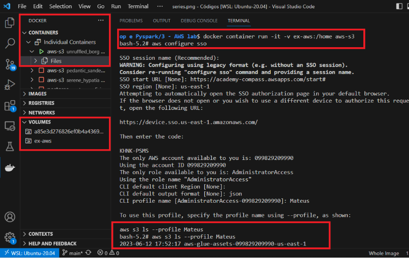
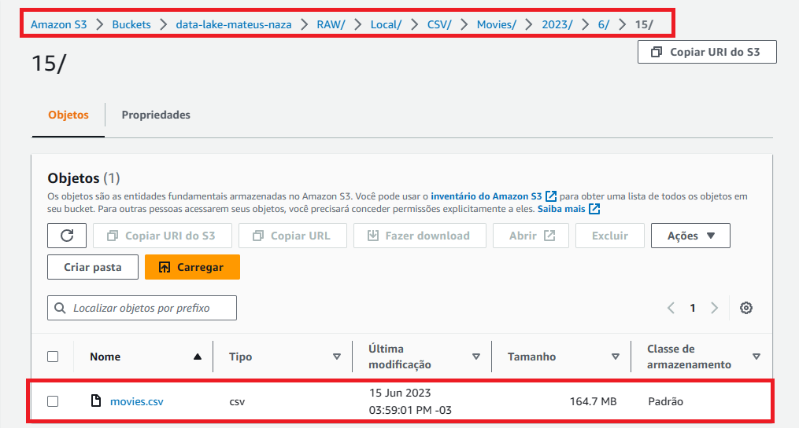
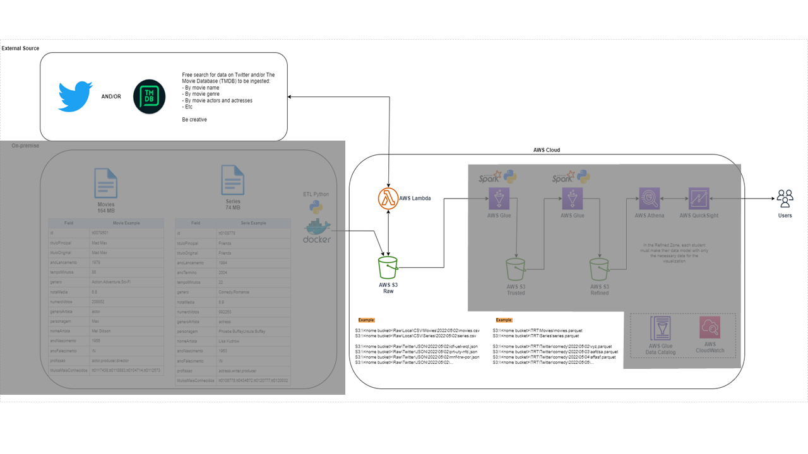
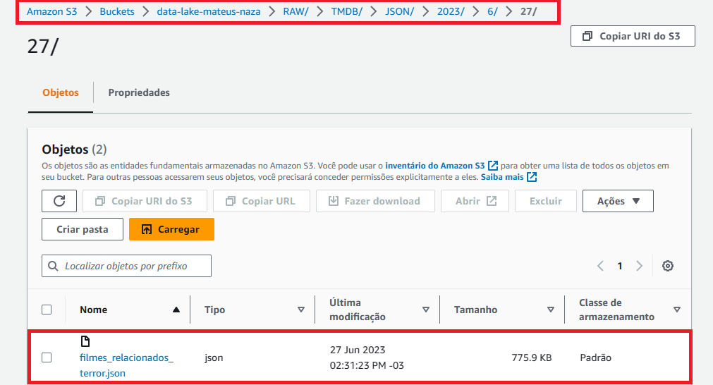

# Desafio Final Processo ETL

## Indice  
- <a href="#Apresentação">Apresentação</a>  
- <a href="#Etapa_1">Etapa 1</a> 
- <a href="#Etapa_2">Etapa 2</a>  
- <a href="#Etapa_3">Etapa 3</a>  
- <a href="#Etapa_4">Etapa 4</a>


## Apresentação   
Esse desafio consiste em fazer o processo completo de ETL utilizando serviços em núvem da AWS, o projeto abrange desde a extração dos dados até a criação de *dashboards* para abstrair valor dos dados. Os dados utilizados foram de **filmes** que contém o gênero **terror** porém, alem disso, todos os filmes dessa amostra contém algum subgênero além do terror. Também coletei dados dos principais artistas de cada filme e tem um detalhe importante, todos os artistas presentes já faleceram. A modelagem detalhada dos dados está logo abaixo. Todo o processo do desafio foi divido em quatro etapas:   
  
- Extração de dados locais  
- Extração de dados via API do TMDB  
- Processamento dos dados  
- Análise e Geração Dashboards  

#### Modelagem dos dados
  
  
## Etapa_1
### Extração de dados locais
  
  

### Container e volume
  
Nessa etapa os dados *on-premisses* foram carregados em um *bucket* S3 utilizando um container *Docker*. Para criar a imagem utilizei como base a imagem do *'amazonlinux'* e no *Dockerfile* inseri todos os comandos para instalar o *python*, a biblioteca *boto3* e também o *CLI* da *AWS*. Além disso foi necessário criar um volume contendo o *script* de extração e os arquivos que deveram ser carregados no S3. Após criar a imagem, iniciei um container com ela onde rodei meu script 'ExtracaoS3.py' que fez o processo de extração dos dados para o S3 dentro do meu *Data Lake* na camada 'RAW'.   
  
  
  
  
### Script e Carregamento  
  
No Script foi particionado o carregamento dos dados para o S3 seguindo o seguinte formato:    
**Bucket/Camada/Origem/Formato/Tipo/Ano/Mes/Dia/Arquivo.csv**, onde o tipo foi subdividido em dois, *'Movies'* e *'Series'*.  
  
  
  
  
## Etapa_2
### Extração de dados TMDB 
  
Nessa etapa os dados foram extraídos da api de filmes do TMDB e carregados no S3 utilizando o *AWS Lambda*. Para extrair utilizei a chave de filmes similares, e inseri um filme de terror e ele me retornou diversos filmes parecidos. No Script 'LambdaExtracao.py' filtrei para trazer apenas os filmes que continham dentro da lista de gêneros o **id '27'** que representa o gênero **terror**. Além dessa API eu utilizei uma para trazer a lista dos id's de gênero juntamente com o nome do gênero e também armazenei ela dentro da camada RAW. 
   
     
   
Para o particionamento usei o mesmo padrão da Etapa 1:  
**Bucket/Camada/Origem/Formato/Ano/Mes/Dia/Arquivo.json**    
   
  
    
  
## Etapa_3
### Processamento dos dados  
  
  
  
### Criação_dos_Jobs
Nessa etapa eu criei dois Jobs um para processar dados '.CSV' e outro para '.JSON' transformando-os para '.PARQUET', os códigos de ambos encontram-se na pasta 'Tarefa 3' como 'GlueProcTrusted_csv.py' e 'GlueProcTrusted_json.py' respectivamente. Os dados dessa etapa passaram da camada *RAW* para camada *TRUSTED* e foram limpos e otimizados para trazer apenas as colunas que desejo trabalhar.


### Processamento CSV
Por questões de ordenação os dados originários do arquivo '.CSV' ficaram armazenados na *Trusted* dentro de uma pasta chamada 'Local'.
Após rodar o código os dados ficaram nesse formato:

#### Schema	
root  
 |-- Titulo_Original: string (nullable = true)  
 |-- Ano_Lancamento: integer (nullable = true)  
 |-- Nota_Media: double (nullable = true)  
 |-- Sexo: string (nullable = true)  
 |-- Nome_Artista: string (nullable = true)  
 |-- Ano_Nascimento: integer (nullable = true)  
 |-- Ano_Falecimento: integer (nullable = true)  


#### DataFrame


### Processamento JSON
Também por ordenação os dados originários dos arquivos '.JSON' ficaram dentro da *Trusted* armazenados em uma pasta própria nomeada de 'TMDB'. Segue abaixo os dados do arquivo. 
Obs.: A coluna **Id_Subgenero** ficou nesse formato estratégicamente, depois que unir os dois arquivos irei fazer o *explode* dela, só não fiz ainda pois na hora de unir poderia ocorrer perda de dados.


#### Schema	
root  
 |-- Nome_Filme: string (nullable = true)  
 |-- Titulo_Original: string (nullable = true)  
 |-- Id_Subgenero: array (nullable = true)  
 |    |-- element: integer (containsNull = true)  
 |-- Contagem_Votos: integer (nullable = true)  
 |-- Popularidade: double (nullable = true)  

#### DataFrame


### Criação de tabela com os dados da Trusted
Realizei a criação de duas tabelas utilizando o *Crawler* do *AWS Glue*: Uma utilizando os dados armazenados na pasta 'Local' e outra da pasta 'TMDB'.


Para visualizar as tabelas criadas e o Schema utilizei o *Athena*.

#### Schema Local


#### Select Local


#### Schema TMDB


#### Select TMDB


### Modelagem Dimensional dos dados
Essa modelagem leva em consideração que todos os filmes são do genero Terror porem possuem também outros subgeneros que podem ser filtrados para fazer combinações de generos (Ex.: Terror com Ficção Científica). O diagrama é composto por uma tabela **fato** que une dentro dela as dimenções **Filme**, **Subgenero**, **Artista** e **Data**.


### Camada Refined
Nessa etapa os dados foram migrados da camada *Trusted* para a camada *Refined*, onde os arquivos que antes eram separados por 'Local' e 'TMDB' foram unidos em um unico *DataFrame* atravez da coluna 'Titulo_Original'. Além disso, a Coluna **Id_Subgenero** foi explodida e filtrada para trazer apenas os filmes que não contem o id de terror pois a intenção dessa coluna é filtrar por subgeneros além do terror. O *DataFrame* possui 152 linhas.

#### Schema
root  
 |-- Nome_Filme: string (nullable = true)  
 |-- Titulo_Original: string (nullable = true)  
 |-- Ano_Lancamento: integer (nullable = true)  
 |-- Nota_Media: double (nullable = true)  
 |-- Sexo: string (nullable = true)  
 |-- Nome_Artista: string (nullable = true)  
 |-- Ano_Nascimento: integer (nullable = true)  
 |-- Ano_Falecimento: integer (nullable = true)  
 |-- Id_Subgenero: integer (nullable = true)  
 |-- Contagem_Votos: integer (nullable = true)  
 |-- Decada_Lancamento: integer (nullable = true)  
 |-- Popularidade: double (nullable = true)  

#### DataFrame


### Criação das tabelas
Para criar as tabelas eu usei o mesmo código de processamento da camada *Refined* 'GlueProcRefined.py' e gravei dentro da camada particionando os dados por tabelas.


Depois criei um *crawler* para cada tabela.


Por fim verifiquei no *Athena* se as tabelas foram criadas como o esperado.


Afim de testar as conexões entre as tabelas executei uma *query* que une todas.

#### Query

```
SELECT    
    ft.id,    
    fi.nome_filme,    
    ar.nome_artista,   
    ft.popularidade,   
    ft.nota_media,   
    dt.ano_lancamento,   
    sg.genero   
FROM fato_filme_subgenero_artista AS ft    
INNER JOIN dim_artista AS ar    
    ON ft.id_artista = ar.id   
INNER JOIN dim_data AS dt    
    ON ft.id_data = dt.id   
INNER JOIN dim_filme AS fi    
    ON ft.id_filme = fi.id   
INNER JOIN dim_subgenero AS sg    
    ON ft.id_subgenero = sg.id;  
```
#### Resultado

  
  
## Etapa_4
### Análise de Dados


Para iniciar a análise criei uma view no *Athena* para depois consumi-la no *QuickSight* utilizando a seguinte *query*:

```
CREATE OR REPLACE VIEW view_subgenero AS
SELECT
    fi.nome_filme as Filme,
    CASE 
        WHEN sg.genero = 'Thriller' THEN 'Suspense'
        ELSE sg.genero
    END AS Genero,
    (dt.decada_lancamento * 10) as Decada,
    ft.nota_media as Nota,
    ft.popularidade as Popularidade,
    ar.nome_artista as Artista,
    ar.sexo as Sexo,
    (ar.ano_falecimento - ar.ano_nascimento) as Idade_Falecimento
FROM fato_filme_subgenero_artista AS ft
INNER JOIN dim_artista AS ar ON ft.id_artista = ar.id
INNER JOIN dim_data AS dt ON ft.id_data = dt.id
INNER JOIN dim_filme AS fi ON ft.id_filme = fi.id
INNER JOIN dim_subgenero AS sg ON ft.id_subgenero = sg.id
```

### Dashboard

O meu dashboard trás a relação entre os diferentes tipos de subgêneros do terror. Iniciei com dois gráficos comparando dados por década que são gerais e não entram no filtro dinâmico, pois é atravéz deles que podem ser escolhidos algumas filtragens interessantes, por exemplo filtrar pela década que teve mais lançamentos, a de maior popularidade ou a que tem uma maior média de notas.


Logo abaixo trago os dados dos subgêneros, onde já são dados dinâmicos e que podem ser filtrados por década. Os gráficos mostram quantos filmes foram lançados por subgênero, qual a nota média e popularidade de cada um. Um ponto interessante de ressaltar é que o subgênero com mais quantidade de filmes pode não ser o mais popular ou o com a melhor nota, esses três dados tem uma independência e isso sera mostrado melhor logo abaixo com os filmes.


Para finalizar, trouxe três gráficos com uma amostra dos 5 melhores filmes que também são dados dinâmicos e podem ser filtrados por década. Os gráficos mostram mais detalhadamente as notas dos filmes indivíduais e é possível observar que alguns filmes possuem mais de um subgênero, e, no gráfico de disperção é possivel observar a independência entre os dados de popularidade e notas pois nem sempre o filme mais popular é o que possui a maior nota.


### Dashboard Completo


